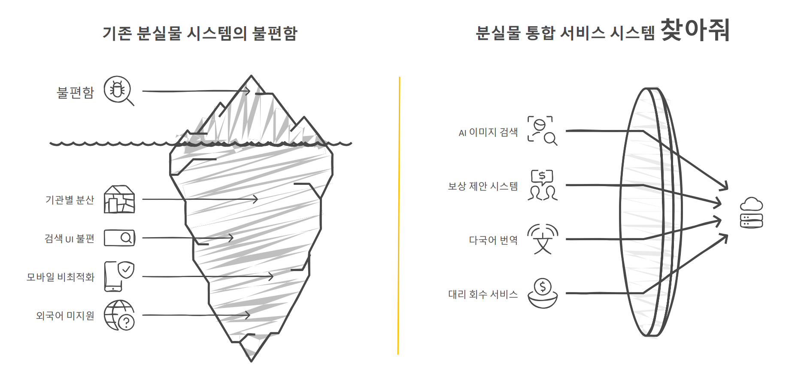
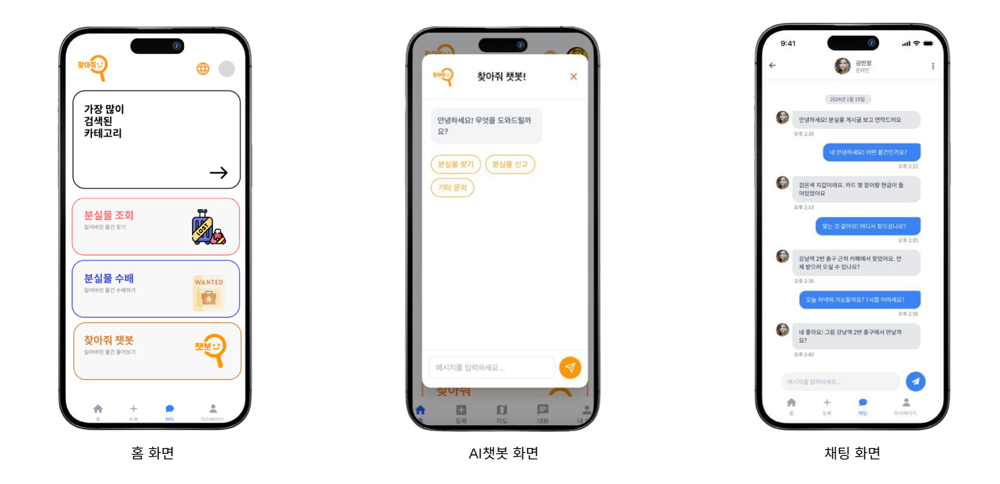
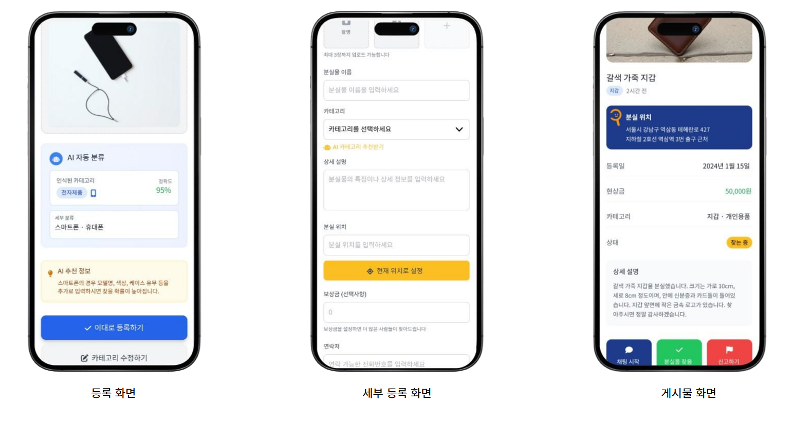

# Grinning (그리닝)

## 📝 프로젝트 소개
AI 기술을 활용해 습득물 사진을 자동 분류하고, 지능형 매칭 알고리즘을 통해 잃어버린 소중한 물건을 주인에게 빠르게 찾아주는 유실물 통합 관리 플랫폼입니다. 이미지 분석과 자연어 처리를 결합하여 반환율을 극대화하는 혁신적인 유실물 관리 경험을 제공합니다.

## 💡 개발 배경 (Why?)
- **파편화된 정보의 통합:** 분실물 정보가 경찰청, 개별 업체, 지역 커뮤니티마다 흩어져 있어 사용자가 어디서 물건을 찾아야 할지 모르는 불편함을 해소하고자 했습니다.
- **데이터 허브 구축:** 경찰청 유실물 API 데이터와 사용자가 직접 등록한 습득물 정보를 한데 모아, 단 한 곳에서 모든 분실물 정보를 확인할 수 있는 통합 검색 환경을 제공합니다.
- **지능형 양방향 매칭:** 단순히 정보를 나열하는 것에 그치지 않고, 내가 잃어버린 물건을 찾아달라는 게시물과 실제 습득된 정보를 AI가 분석하여 주인에게 연결해주는 능동적인 반환 시스템을 목표로 합니다.
- **분류 및 등록 자동화:** 정보 통합 과정에서 발생하는 대량의 데이터를 AI(YOLOv8)가 자동으로 분류하여 사용자와 관리자의 등록 번거로움을 획기적으로 줄였습니다.

## 👥 팀원 정보
| 사진 | GitHub | 담당 기능 |
| :---: | :---: | :--- |
|  | [@kth4778](https://github.com/kth4778) | - 로그인 기능 개발 - 경찰청 습득물 API 명세서 작성 - 기획 및 로고 디자인 제작 |
|  | [@joon0890](https://github.com/jwhitekim) | - YOLO AI 모델 개발 - 챗봇 AI 담당 - 게시판 처리 |

## 📸 화면별 이미지

